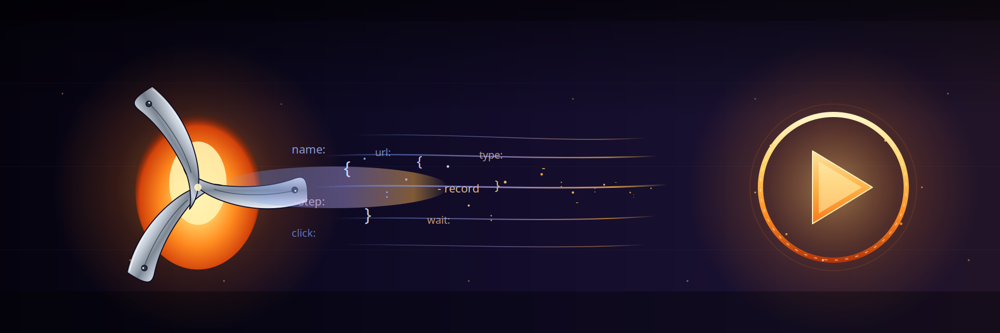
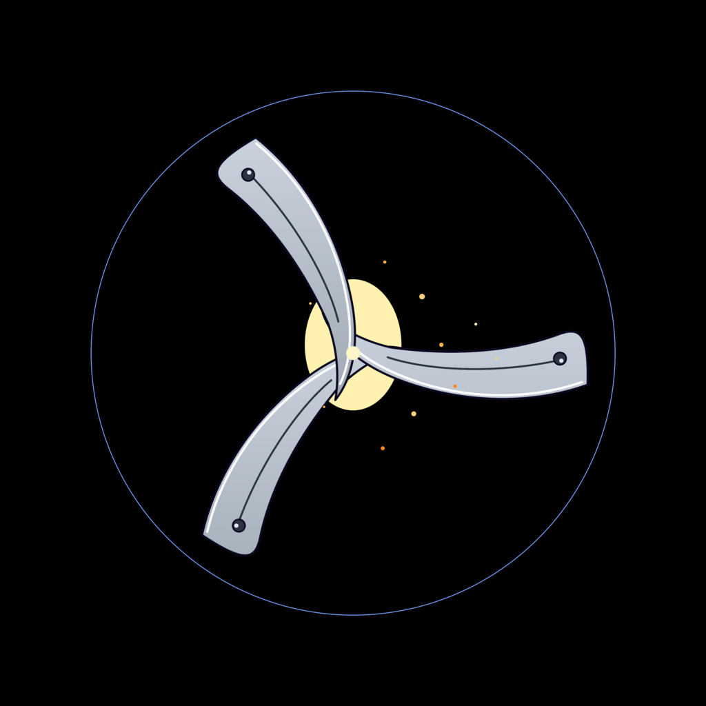

<p align="center">
  
</p>

<h1 align="center">
  <br/>
  ⚡ ClawForge
</h1>

> **Demo videos as code.** Write a YAML script, get a polished MP4 with browser recording and AI voiceover. Built for hackathons, product demos, and AI agents.

<p align="center">
  <a href="https://www.npmjs.com/package/clawforge"></a>
  <a href="CHANGELOG.md"></a>
  <a href="LICENSE"></a>
  <a href="https://nodejs.org"></a>
  <a href="https://modelcontextprotocol.io"></a>
  <a href="#"></a>
</p>

<p align="center">
  <a href="#60-second-quickstart">Quickstart</a> ·
  <a href="#use-it-from-claude-code-mcp">Claude Code</a> ·
  <a href="#use-it-with-buildingai-mcp-over-sse">BuildingAI / SSE</a> ·
  <a href="docs/SDK.md">SDK docs</a> ·
  <a href="CHANGELOG.md">Changelog</a>
</p>

```
Script (YAML) → Playwright (record) → edge-tts (narrate) → ffmpeg (render) → MP4
```

---

## 🆕 What's new in 0.4.0

- **`clawforge init`** — interactive CLI wizard generates scripts in seconds. Pick from 6 templates or build custom scenes. No YAML knowledge needed.
- **`clawforge demo`** — run the self-demo with a single command. See ClawForge in action without writing anything.
- **Auto-debug on failure** — when a browser action fails, ClawForge auto-captures a screenshot and page HTML so you know exactly what went wrong.
- **Docker support** — `Dockerfile` + `docker-compose.yml` for zero-setup containerized usage.
- **Template gallery** — 5 built-in templates: `landing-page`, `hackathon`, `saas-demo`, `tutorial`, `mobile-app`.
- **MCP over SSE** — new `clawforge-mcp-sse/` HTTP wrapper for web-based agents (BuildingAI, browser tools). See [Use it with BuildingAI](#use-it-with-buildingai-mcp-over-sse).
- **Docker sidecar** — `docker-compose.buildingai.yml` for BuildingAI integration.

---

## Why ClawForge?

You ship a feature. Your demo video is outdated. You re-record it. The UI changes again. You re-record again. **Stop.**

ClawForge treats demo videos like code — version-controlled, reproducible, rebuildable in one command. UI changes? Rerun the script. Done.

- 🎬 **Scripted, not recorded** — YAML defines scenes, narration, and browser actions
- 🎙️ **AI voiceover, 40+ languages** — Microsoft edge-tts neural voices, free
- 🤖 **Agent-native** — SDK, MCP server (stdio + SSE), structured errors, event hooks
- 🔁 **Reproducible** — same script, same video, every time
- 💾 **Resumable** — checkpoint on failure, resume mid-pipeline
- 🐳 **Container-ready** — Docker sidecar with healthcheck, non-root, 2gb shm for Playwright
- 🆓 **MIT, no API keys** — runs entirely on your machine

---

## 30-second quickstart

### 🐳 Option A: Docker (zero install)
```bash
docker run -v $(pwd):/app clawforge/clawforge init
docker run -v $(pwd):/app clawforge/clawforge my-demo.yaml
```

### ⚡ Option B: npm
```bash
# 1. Install
npm install -g clawforge
pip install edge-tts
npx playwright install chromium

# 2. Create your first script
clawforge init --template landing-page

# 3. Produce the video
clawforge my-demo.yaml

# 4. Watch your video
xdg-open output/output.mp4   # Linux
open output/output.mp4       # macOS
```

### 🎮 Option C: Just see it work
```bash
npx clawforge demo
```

---

## What a script looks like

```yaml
project:
  name: "My SaaS Demo"
  url: "http://localhost:3000"
  output: "./output"
  viewport: { width: 1280, height: 720 }

voice:
  engine: "edge-tts"
  voice: "en-US-AndrewMultilingualNeural"
  rate: "-5%"

scenes:
  - name: "intro"
    narration: "Welcome to Acme — the fastest way to ship."
    actions:
      - { type: "goto", url: "http://localhost:3000" }
      - { type: "wait", ms: 3000 }

  - name: "signup"
    narration: "Sign up takes ten seconds."
    actions:
      - { type: "click", selector: "text=Get Started" }
      - { type: "fill", selector: "input[type=email]", text: "demo@acme.dev" }
      - { type: "press", selector: "input[type=email]", key: "Enter" }
      - { type: "wait", ms: 4000 }

  - name: "outro"
    narration: "That's it. Try Acme today."
    actions:
      - { type: "scroll", y: 0 }
      - { type: "wait", ms: 2000 }
```

That's the whole demo. Run `clawforge my-demo.yaml` and you get an MP4.

---

## Use cases

| You are... | ClawForge gives you... |
|---|---|
| 🚀 Hackathon submitter | A polished demo video before the deadline, rebuildable until last minute |
| 💼 SaaS founder | Landing page demos that update with your UI, no re-recording |
| 📚 DevRel / docs author | Tutorial videos checked into the repo alongside code |
| 🤖 AI agent developer | A `produce_video` tool your agent can call via MCP (stdio or SSE) |
| 🧪 QA engineer | Visual regression videos generated in CI per PR |

---

## Actions reference

| Action | Parameters | Description |
|---|---|---|
| `goto` | `url` | Navigate (waits for networkidle, 30s timeout) |
| `click` | `selector` | Click first matching element |
| `fill` | `selector`, `text` | Type with `pressSequentially` (React-safe, 30ms/key) |
| `press` | `selector?`, `key` | Press a key (e.g. `Control+Enter`) |
| `scroll` | `y` (absolute) or `dy` (relative) | Smooth scroll |
| `wait` | `ms` | Pause |
| `screenshot` | `name?` | Save PNG to `<output>/screenshots/` |

Selectors are [Playwright locators](https://playwright.dev/docs/locators) — CSS, text, role, testid, etc.

---

## CLI commands

```bash
clawforge <script.yaml>              # Produce a video
clawforge init                       # Create a script interactively
clawforge demo                       # Run the self-demo instantly
clawforge validate <script.yaml>     # Validate without running
clawforge check-deps                 # Check all dependencies
clawforge resume <checkpoint.json>   # Resume from last checkpoint

# Flags
-o, --output <dir>     Override output directory
-v, --verbose          Verbose logging
--skip-deps            Skip dependency check
--template <name>      Use a template with init (non-interactive)
```

---

## Use it as a library

```js
import { ClawForgeSDK } from 'clawforge';

const forge = new ClawForgeSDK({ verbose: true });

forge.on('stage:start', ({ stage }) => console.log(`▶  ${stage}`));
forge.on('stage:complete', ({ stage }) => console.log(`✓  ${stage}`));
forge.on('scene:complete', ({ scene }) => console.log(`  ✅ ${scene}`));

const result = await forge.produce('./demo.yaml');
console.log(result.outputPath); // ./output/output.mp4
```

Full SDK docs: [docs/SDK.md](docs/SDK.md)

---

## Use it from Claude Code (MCP — stdio)

Add to `.claude/settings.json`:

```json
{
  "mcpServers": {
    "clawforge": { "command": "npx", "args": ["clawforge-mcp"] }
  }
}
```

Now Claude can call:
- `clawforge_produce_video` — generate a video from a script
- `clawforge_validate_script` — validate without executing
- `clawforge_check_dependencies` — verify ffmpeg, edge-tts, Playwright
- `clawforge_dry_run` — pre-flight check before production

> Prefer a network transport? See [Use it with BuildingAI (MCP over SSE)](#use-it-with-buildingai-mcp-over-sse) below — same four tools, HTTP/SSE instead of stdio.

---

## Use it with BuildingAI (MCP over SSE)

ClawForge v0.4.0 ships an HTTP/SSE transport wrapper so web-based agents like **BuildingAI** can call the same MCP tools over the network instead of stdio.

### Quick start (local)

```bash
cd clawforge-mcp-sse
npm install
npm start
# Server runs on http://0.0.0.0:3100/mcp
```

Verify:

```bash
curl http://127.0.0.1:3100/health
# {"status":"ok","sessions":0,"dependencies":{"ffmpeg":true,"ffprobe":true,"playwright":true,"edgeTts":true}}
```

### Endpoints

| Method | Path | Purpose |
|---|---|---|
| `GET`  | `/mcp` | Establish SSE session (returns `endpoint` event with POST URL) |
| `POST` | `/mcp?sessionId=...` | Send JSON-RPC message (`tools/list`, `tools/call`) |
| `GET`  | `/health` | Liveness + dependency status |

### BuildingAI config

Drop `examples/buildingai-mcp-config.json` into your BuildingAI MCP config:

```json
{
  "mcpServers": {
    "clawforge": {
      "transport": "sse",
      "url": "http://clawforge:3100/mcp",
      "description": "ClawForge video production toolkit",
      "tools": [
        "clawforge_produce_video",
        "clawforge_validate_script",
        "clawforge_check_dependencies",
        "clawforge_dry_run"
      ]
    }
  }
}
```

### Full stack with Docker

```bash
docker compose -f docker-compose.buildingai.yml up
```

Spins up Postgres + Redis + BuildingAI + ClawForge sidecar (shm_size 2gb for Playwright, memory limit 4g, non-root user, healthcheck).

### Architecture

```
BuildingAI Agent                    ClawForge Container
+-----------------+    SSE/HTTP     +--------------------------+
|  user asks      |                |  Express (port 3100)     |
|  "make a demo"  | --GET /mcp-->  |    | SSE stream          |
|                 | <--endpoint--  |  SSEServerTransport      |
|  agent writes   |                |    |                     |
|  YAML script    | --POST /mcp--> |  ClawForgeMCPServer      |
|                 |                |    |                     |
|  -> MP4 path    | <--message---  |  Playwright + edge-tts   |
+-----------------+                |  + ffmpeg                |
                                   |  /app/output/demo.mp4    |
                                   +--------------------------+
```

Full SSE docs: [docs/SDK.md#buildingai-mcp-sse-integration](docs/SDK.md#buildingai-mcp-sse-integration)

---

## Use it with AI coding agents (Skills)

For agents that support the Skills convention (Hermes Agent, Claude Skills), this repo ships a pre-packaged skill at [`skills/clawforge/`](skills/clawforge/SKILL.md).

```bash
# For Hermes Agent users
ln -s "$(pwd)/skills/clawforge" ~/.hermes/skills/clawforge
```

Then your agent can `skill_view(name='clawforge')` to load full ClawForge usage on demand.

---

## How it compares

|   | ClawForge | Loom | Synthesia | OBS | Playwright codegen |
|---|---|---|---|---|---|
| Script-as-code | ✅ | ❌ | ⚠️ template | ❌ | ⚠️ partial |
| Reproducible from source | ✅ | ❌ | ⚠️ | ❌ | ⚠️ |
| AI voiceover included | ✅ | ❌ | ✅ | ❌ | ❌ |
| Real browser interaction | ✅ | ✅ (manual) | ❌ | ✅ | ✅ |
| Agent / MCP support (stdio + SSE) | ✅ | ❌ | ❌ | ❌ | ❌ |
| Docker sidecar ready | ✅ | ❌ | ❌ | ❌ | ❌ |
| 40+ languages free | ✅ | — | 💰 | — | — |
| Cost | Free, MIT | Freemium | 💰💰💰 | Free | Free |

---

## Requirements

### Local install
- Node.js ≥ 20
- Python 3 (for `edge-tts`)
- `ffmpeg` & `ffprobe` in PATH
- Chromium (installed via `npx playwright install chromium`)

### Docker
```bash
docker pull clawforge/clawforge
docker run -v $(pwd):/app clawforge/clawforge --help
```

All dependencies pre-installed. See [Dockerfile](Dockerfile) for details.

Run `clawforge check-deps` to verify your environment.

---

## Reliability features

- **Retry policy** — exponential / linear / constant backoff for network and selector errors
- **Checkpointing** — JSON checkpoints written to `./.clawforge-checkpoints/` after each stage
- **Resume** — pick up from the last checkpoint with `clawforge resume <checkpoint.json>`
- **Structured errors** — `ClawForgeError` with codes: `NETWORK_TIMEOUT`, `PLAYWRIGHT_ERROR`, `SELECTOR_NOT_FOUND`, `TTS_ERROR`, `NAVIGATION_FAILED`, `FFMPEG_ERROR`
- **Session TTL (SSE)** — idle MCP SSE sessions auto-cleanup after 30 minutes
- **Health endpoint (SSE)** — `/health` probes ffmpeg, ffprobe, Playwright, edge-tts before returning `ok`

---

## Roadmap

- [x] Burn-in subtitles (SRT generation)
- [x] Background music & ducking
- [x] Webcam overlay (picture-in-picture)
- [ ] Headed mode option
- [ ] Multi-browser support (Firefox/WebKit)
- [ ] Voice cloning integration
- [ ] Cloud rendering for CI
- [ ] Template gallery
- [ ] Migrate SSE → Streamable HTTP transport (SDK 1.29+ recommended)

[See open issues →](https://github.com/Dr-SoloDev/clawforge/issues) · [Contribute](CONTRIBUTING.md) · [Changelog](CHANGELOG.md)

---

## Origin Story

Last year, I — Dr.SoloDev — joined a hackathon with a project I was really confident in. The idea was strong, and the development was going smoothly.

However, everything came to a halt at the final stage: creating the presentation video.

I spent many days and nights trying to edit the video myself. But since video editing is not my strength, I couldn't finish it in time. In the end, my solid project missed the submission deadline and never got the chance to shine.

The frustration I felt during that time was immense.

I began searching for tools that could help generate videos, but the more I looked, the more disappointed I became. No single tool could do the job completely.

- Some tools could record the screen but had no voice.
- Some had great voiceovers but poor control.
- Some used AI but produced unstable results.
- Others looked good but were too slow or complicated.

They were all incomplete tools — like broken machines with hands but no legs, eyes but no voice, or legs but no brain.

Tired of the limitations, I decided to take the best parts from multiple tools and combine them. With the help of my AI Agent **Hermes Turbo** as a development partner, I built the solution I truly needed.

And so, **ClawForge** was born.

The first time I saw my agent successfully run a simple YAML script and generate a complete, high-quality presentation video in just minutes, I was truly amazed.

ClawForge was not created from just an idea. It was born from real pain — the pain of developers who pour their heart into a project, only to fail at the final step because of video production.

That's why I decided to open-source it. So that other developers don't have to go through the same frustrating experience I did.

> **Forged by an AI agent, for AI agents — and for every solo developer who's ever lost a hackathon to a missing demo video.**

Every visible artifact in this repo — the code, the hero video, the logo, the banner, the docs, the tests, the CI — was produced end-to-end by AI agents.เทอโบ & human Dr.solodev..

Built by **[Dr.SoloDev](https://github.com/Dr-SoloDev)** ⚡ — full-cycle developer (Solana / DeFi / AI agents) based in Thailand 🇹🇭

## Connect

<p align="left">
  <a href="https://github.com/Dr-SoloDev"></a>
  <a href="https://x.com/AChaisirum"></a>
  <a href="https://t.me/contact_Drsolodev"></a>
  <a href="https://discord.gg/APfu9urd"></a>
  <a href="https://www.facebook.com/share/1GqRRgaDb9/"></a>
</p>

Open to collaborations, hackathon partnerships, and DeFi / AI agent projects.

## Sponsor

If ClawForge saved you from a last-minute demo video disaster, consider supporting its development.

<p align="left">
  <a href="https://github.com/sponsors/Dr-SoloDev"></a>
</p>

<!--
GitHub strips <iframe> tags from README.md, so the sponsor card below only
renders on pages that allow raw HTML (e.g. a GitHub Pages site or docs site),
not on this README itself.

<iframe src="https://github.com/sponsors/Dr-SoloDev/card" title="Sponsor Dr-SoloDev" height="225" width="600" style="border: 0;"></iframe>
-->

---

## License

[MIT](LICENSE)
